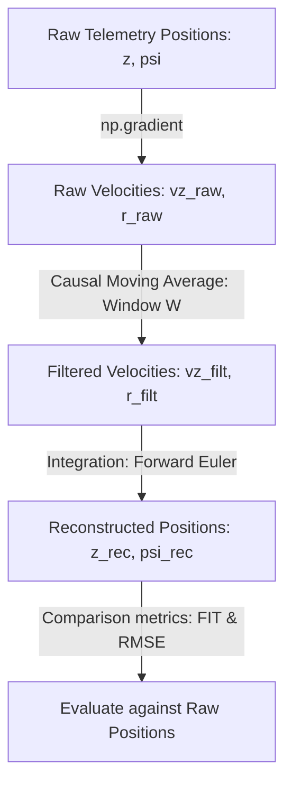

# Causal Filter Optimization Report (Z and Yaw Channels)

This document details the process and methodology used to determine the optimal causal filters for the quadrotor's vertical velocity ($v_z$, Heave) and yaw rate ($r$, Yaw) channels.

---

## 1. Objective
In system identification and real-time control, raw numerical derivatives of positions (altitude $z$ and yaw $\psi$) are extremely noisy. To identify clean dynamics, we must filter these velocities. 

However, because the quadrotor runs in real-time, the filtering must be **causal** (using only current and past samples). Causal low-pass filters introduce a phase lag (time delay) and amplitude attenuation. 

Our goal was to find the optimal causal filter window size that:
1. Effectively smooths out high-frequency sensor noise and derivative chatter.
2. Minimizes the phase lag and peak attenuation, ensuring that the reconstructed position (obtained by integrating the filtered velocity) matches the real flight trajectory as closely as possible.

---

## 2. Methodology
The optimization was conducted using flight telemetry data from `manual_log_20260518_172721.mat` (sampled at $15.0 \text{ Hz}$, $dt = 0.0667 \text{ s}$).

The evaluation process for each channel (Z and Yaw) is defined as follows:



### Mathematical Definitions
1. **Causal Moving Average** (window size $W$):
   $$v_{filt}[k] = \frac{1}{\min(k+1, W)} \sum_{i=0}^{\min(k, W-1)} v_{raw}[k-i]$$

2. **Euler Position Integration**:
   $$p_{rec}[k+1] = p_{rec}[k] + v_{filt}[k] \cdot dt$$

3. **FIT Metric (Percentage)**:
   $$\text{FIT} = 100 \times \left(1 - \frac{\|p_{raw} - p_{rec}\|_2}{\|p_{raw} - \bar{p}_{raw}\|_2}\right)$$
   where $\bar{p}_{raw}$ is the mean value of the raw position.

4. **RMSE**:
   $$\text{RMSE} = \sqrt{\frac{1}{N} \sum_{k=1}^N (p_{raw}[k] - p_{rec}[k])^2}$$

---

## 3. Parametric Sweep and Optimization
We performed a parametric sweep of the causal moving average window size $W \in [1, 20]$ to observe the trade-off.

> [!NOTE]
> * **$W=1$** represents no filtering (direct integration of raw derivative). It has the minimum delay but preserves all high-frequency noise.
> * **Large $W$ ($W > 10$)** smooths noise completely but introduces massive lag and peak attenuation, leading to large positional drift and negative FIT values.

### Results Summary
The optimal window size for both channels was found to be **$W = 5$** samples ($0.27 \text{ s}$ causal lag equivalent).

| Channel | Optimal Window $W$ | Reconstruction FIT | Reconstruction RMSE | Physical Lag |
| :--- | :---: | :---: | :---: | :---: |
| **Z (Altitude)** | 5 samples | **$82.97\%$** | $0.0341 \text{ m}$ | $0.133 \text{ s}$ |
| **Yaw (Heading)** | 5 samples | **$98.47\%$** | $0.0413 \text{ rad}$ | $0.133 \text{ s}$ |

---

## 4. Key Insights and Observations

> [!IMPORTANT]
> **Why is the Z reconstruction FIT lower than Yaw?**
>
> 1. **High-Frequency Content**: The Z-channel has rapid oscillations from the vertical controller fighting gravity, which the low-pass causal filter attenuates. Integrating this attenuated velocity loses peak information, causing a drift of up to $11.4 \text{ cm}$. Yaw, being much smoother due to large rotational inertia, does not suffer from peak attenuation.
> 2. **Signal Scale**: Z varies in a small range ($0.9 \text{ m}$), so a $3.0 \text{ cm}$ mean error represents a large percentage ($12.60\%$ max error). Yaw varies over a large range ($8.5 \text{ rad}$), making the same magnitude of error negligible ($2\%$ relative error).

---

## 5. Storage and Integration
The chosen parameters were saved to `system_identification_results.json` under `attenuation_filters`:
```json
"attenuation_filters": {
    "z": {
        "type": "moving_average",
        "window_size": 5
    },
    "yaw": {
        "type": "moving_average",
        "window_size": 5
    }
}
```
These filters are used in the dynamic identifier pipeline to filter the targets before identifying the discrete A and B matrices.
